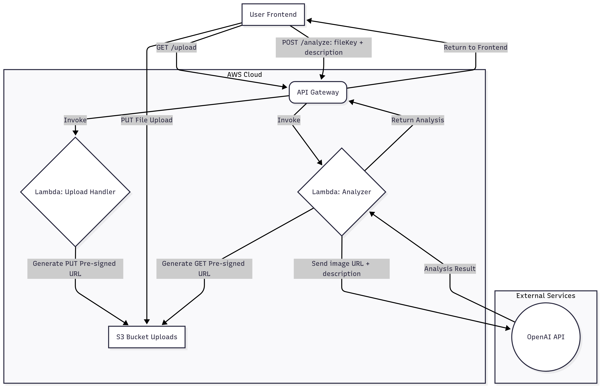

# Claim Analyzer Backend Infrastructure

This project demonstrates the setup of a backend infrastructure for a claim analysis. The goal was to build a functional proof-of-concept that showcases an understanding of core AWS serverless patterns, Infrastructure as Code (IaC) with Terraform, and basic CI/CD principles, even with limited prior experience in these specific technologies. The emphasis was on learning, adopting best practices, and creating a clear, documented, and deployable solution.

**Demo Link:**  
[Live Frontend Demo](http://my-react-app-cicd-alb-2013842589.ap-southeast-1.elb.amazonaws.com/)


## Features

### Serverless Backend
- **AWS Lambda**: Two functions (`upload_handler`, `submission_analyzer`) for handling image uploads and AI analysis.
- **API Gateway**: Provides HTTP endpoints (`GET /upload`, `POST /analyze`) to trigger Lambda functions.
- **S3**: Securely stores uploaded images, with versioning, encryption, and CORS configured for frontend interaction.

### Infrastructure as Code (IaC)
- **Terraform**: Manages all backend AWS resources (IAM, S3, API Gateway, Lambda) for consistent, repeatable, and version-controlled deployments.

### CI/CD
- **GitHub Actions**: Automates Lambda artifact builds and Terraform infrastructure deployments.

### Security & Configuration
- **IAM**: Implemented with the principle of least privilege for Lambda roles.
- **CORS**: Configured to allow frontend access to backend resources.


## Architecture Diagram (Backend Focus)



## Design Choices Explanation (Backend)

When building this backend, my main goals were to:
- Create a functional system
- Learn core AWS serverless patterns
- Understand how to manage infrastructure using Terraform and CI/CD

---

### Serverless Backend (Lambda, API Gateway, S3)

#### Why AWS Lambda?
**Lambda** it's AWS's way of running code without managing servers. This was a great learning opportunity to understand event-driven architectures. Key benefits include:
- Automatic scaling
- Pay-as-you-go pricing
- No server maintenance

#### Why API Gateway?
**API Gateway** acts as the front door to the backend. It provides:
- Clean HTTP endpoints (e.g., `GET /upload`, `POST /analyze`)
- Routing to the correct Lambda function
- A secure, managed interface for client interaction

#### Why S3?
**S3** is AWS's highly available and durable object storage. I used it to store uploaded images securely.

Key design choice:
- **Pre-signed URLs**: Allow users to upload directly to S3, improving performance and reducing Lambda costs.

Additional considerations:
- **Versioning**: Enabled for data safety
- **Encryption**: Applied to protect stored data

---

### Infrastructure as Code (IaC) – Terraform

**Requirement**: All AWS resources must be provisioned using Terraform.

#### Why Terraform?
Terraform was a major learning focus. It allows the entire infrastructure to be defined and managed through code, offering several advantages:

- **Repeatable**: Deploy the same infrastructure reliably
- **Version Controlled**: Track all changes in Git
- **Consistent**: Ensure environments are set up identically

#### My Experience
Although new to Terraform, I structured the code with best practices:
- Separated concerns into modular files (`iam.tf`, `s3.tf`, `lambda_upload.tf`, etc.)
- Used input variables for reusability and flexibility

---

### CI/CD – GitHub Actions

**Requirement**: Automate builds and deployments.

#### Why GitHub Actions?
Using **GitHub Actions** helped me learn and implement CI/CD best practices. My pipeline includes:

- Build Lambda functions into `.zip` artifacts
- Run `terraform fmt -check` and `terraform validate`
- Generate a Terraform plan to preview changes
- Apply Terraform changes to production on `main` branch merge

This demonstrates a clear understanding of automated software delivery processes.

---

### Assumptions Made During Development

- **AWS Environment**: Access to an AWS account with sufficient permissions in `ap-southeast-1` (or equivalent)
- **OpenAI API Key**: Assumed to be provided via environment variables locally and GitHub Secrets for CI/CD. For production, I would use AWS Systems Manager Parameter Store or Secrets Manager.
- **Local Setup**: Assumed the developer has Docker, Git, Terraform, and AWS CLI installed and configured
- **Existing IAM Resources**: Expected pre-existing IAM roles or policies. Learned to use `terraform import` to avoid conflicts and prevent unnecessary resource recreation.
- **Frontend Interaction**: Assumed the frontend would properly call the backend endpoints and handle pre-signed S3 URLs


## Tech Stack
*   Infrastructure as Code: Terraform
*   Backend Compute: AWS Lambda (Python 3.12)
*   API Layer: AWS API Gateway (HTTP API)
*   Storage: AWS S3 (with versioning, encryption, CORS)
*   AI Integration: OpenAI API (GPT-4o)
*   CI/CD: GitHub Actions
*   Local Development/Testing: Postman

## Project Structure
```
project/
├── .github/
│   └── workflows/
│       └── deploy.yml              # GitHub Actions CI/CD pipeline
├── lambda/                         # Lambda function source code
│   ├── upload_handler           
│   |   └── upload_handler.py       # Generates pre-signed S3 upload URLs
│   ├── submission_analyzer         
│   |   └── submission_analyzer.py  # Analyzes submissions using OpenAI
├── terraform/                      # Infrastructure as Code (Terraform)
│   ├── main.tf                     # Orchestrates the creation of all infrastructure resources.
│   ├── provider.tf                 # Configures the AWS provider and region.
│   ├── variables.tf                # Defines input variables for customization.
│   ├── iam.tf                      # Defines IAM roles and policies for Lambda execution and S3 access.
│   ├── s3.tf                       # Configures the S3 bucket, including CORS, versioning, and encryption.
│   ├── s3_policy.tf                # Sets the bucket policy for Lambda access.
│   ├── lambda_upload.tf            # Configures the Lambda function for generating pre-signed upload URLs.
│   ├── lambda_analyze.tf           # Configures the Lambda function for AI analysis.
│   └── api_gateway.tf              # Sets up API Gateway routes and integrates with Lambda functions.
├── scripts/                        # Helper and utility scripts
│   ├── build-lambdas.sh            # Package Lambda functions into ZIPs
│   └── deploy.sh                   # Local deployment helper
├── artifacts/                      # Compiled Lambda ZIP artifacts
│   ├── upload_handler.zip
│   └── submission_analyzer.zip
├── README.md                       # Project overview and instructions
└── .gitignore                      # Git ignore rules

```
 

# Deployment Guide

This guide details how to deploy the backend infrastructure using Terraform.

---

## Part 1: Infrastructure Deployment (Terraform)

This section covers provisioning the backend AWS resources.

### Prerequisites

- **AWS Account**: With necessary IAM permissions
- **AWS CLI**: Installed and configured (`aws configure`)
- **Terraform**: Installed (>= 1.12.0)
- **Git**: Installed
- **OpenAI API Key**: Needed for the analysis function
- **GitHub Repository**: Backend Terraform code pushed

---

### Deployment Steps

#### 1. Get the Code

```bash
git clone https://github.com/amydev-me/ClaimAnalyzer.git
cd ClaimAnalyzer
```

#### 2. Set Up Local Environment Variables: Create a .env file in the root (add to .gitignore!) for sensitive data:

```bash
# .env
export TF_VAR_openai_api_key="sk-YOUR_OPENAI_API_KEY_HERE"
export AWS_ACCESS_KEY_ID="YOUR_AWS_ACCESS_KEY_ID"
export AWS_SECRET_ACCESS_KEY="YOUR_AWS_SECRET_ACCESS_KEY"
export AWS_REGION="ap-southeast-1"
```

#### 3. Import Existing IAM Resources (If Necessary): If the IAM role/policy already exists, I learned to use terraform state rm and terraform import to manage them:

```bash
cd terraform
terraform state rm aws_iam_role.lambda_exec
terraform import aws_iam_role.lambda_exec claim-analyzer-lambda-execution-role
terraform state rm aws_iam_policy.lambda_s3_access
terraform import aws_iam_policy.lambda_s3_access <YOUR_IAM_POLICY_ARN>
cd ..
```

#### 4. Build Lambda Artifacts: Package Lambda code into zip files using the provided script.

```bash
chmod +x scripts/build-lambdas.sh
scripts/build-lambdas.sh
```

#### 5. Deploy Infrastructure with Terraform:

```bash
cd terraform
terraform init
terraform plan -var="upload_handler_zip_path=../artifacts/upload_handler.zip" -var="submission_analyzer_zip_path=../artifacts/submission_analyzer.zip" -var="openai_api_key=${TF_VAR_openai_api_key}" -var="environment=dev"
terraform apply -var="upload_handler_zip_path=../artifacts/upload_handler.zip" -var="submission_analyzer_zip_path=../artifacts/submission_analyzer.zip" -var="openai_api_key=${TF_VAR_openai_api_key}" -var="environment=dev"
```

## CI/CD Pipeline (GitHub Actions)

This section outlines the automated process for deploying backend infrastructure.

---

### Prerequisites

- Backend Terraform code is pushed to **GitHub**
- **GitHub Secrets** are configured:
  - `AWS_ACCESS_KEY_ID`
  - `AWS_SECRET_ACCESS_KEY`
  - `OPENAI_API_KEY` 

---

### Pipeline Overview

- **Build**: 
  - Packages Lambda functions into `.zip` files
- **Plan**: 
  - Runs `terraform fmt -check`, `terraform validate`, and generates a Terraform plan for the `dev` environment
- **Deploy**: 
  - Applies infrastructure changes to the `prod` environment on pushes to the `main` branch 

## Testing the Backend

This section explains how to verify the backend functionality after deployment.

---

### Local Backend Testing (using `curl`)

These commands help validate the core functionality and troubleshoot issues.

#### 1. Get Upload URL

```bash
curl -X GET "YOUR_API_GATEWAY_URL/upload?filename=test.jpg"
```
This returns a pre-signed S3 URL that can be used to upload an image directly.


#### 2. Upload File to S3

```bash
curl -X PUT "PRE_SIGNED_URL" \
     -H "Content-Type: image/jpeg" \
     --upload-file ./test.jpg
```

#### 3. Analyze File

```bash
curl -X POST "YOUR_API_GATEWAY_URL/analyze" \
     -H "Content-Type: application/json" \
     -d '{
           "filename": "test.jpg",
           "description": "Test description"
         }'
```
 
